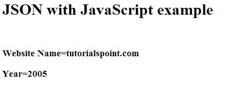
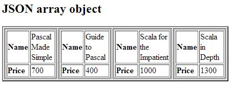

# JSON 对象

## 创建简单的对象

JSON 对象可以使用 JavaScript 创建。我们来看看使用 JavaScript 创建 JSON 对象的各种方式：

- 创建一个空对象：

```javascript
var JSONObj = {};
```

- 创建一个新对象：

```javascript
var JSONObj = new Object();
```

- 创建一个 __bookname__ 属性值为字符串，__price__属性值为数字的对象。可以通过使用 '.' 运算符访问属性。

```javascript
var JSONObj = { "bookname ":"VB BLACK BOOK", "price":500 };
```

这里有一个例子，展示了在 JavaScript 中使用 JSON 创建对象，可以将下面的代码保存为 __json_object.htm__：

```html
<html>
<head>
<title>Creating Object JSON with JavaScript</title>
<script language="javascript" >

	var JSONObj = { "name" : "tutorialspoint.com", "year"  : 2005 };
	document.write("<h1>JSON with JavaScript example</h1>");
	document.write("<br>");
	document.write("<h3>Website Name="+JSONObj.name+"</h3>");  
	document.write("<h3>Year="+JSONObj.year+"</h3>");  

</script>
</head>
<body>
</body>
</html>
```

尝试使用 IE 或者任何其他启用了 JavaScript 的浏览器打开这个页面，生成的结果如下所示：



## 创建数组对象

下面的例子展示了在 JavaScript 中使用 JSON 创建数组对象，可以将下面的代码保存为 __json_array_object.htm__：

```html
<html>
<head>
<title>Creation of array object in javascript using JSON</title>
<script language="javascript" >

document.writeln("<h2>JSON array object</h2>");

var books = {
	"Pascal" : [ 
		{ "Name"  : "Pascal Made Simple", "price" : 700 },
		{ "Name"  : "Guide to Pascal", "price" : 400 }
	],                       
	"Scala"  : [
		{ "Name"  : "Scala for the Impatient", "price" : 1000 }, 
		{ "Name"  : "Scala in Depth", "price" : 1300 }
	]    
}    

var i = 0
document.writeln("<table border='2'><tr>");
for(i=0;i<books.Pascal.length;i++)
{	
	document.writeln("<td>");
	document.writeln("<table border='1' width=100 >");
	document.writeln("<tr><td><b>Name</b></td><td width=50>"
	+ books.Pascal[i].Name+"</td></tr>");
	document.writeln("<tr><td><b>Price</b></td><td width=50>"
	+ books.Pascal[i].price +"</td></tr>");
	document.writeln("</table>");
	document.writeln("</td>");
}

for(i=0;i<books.Scala.length;i++)
{
	document.writeln("<td>");
	document.writeln("<table border='1' width=100 >");
	document.writeln("<tr><td><b>Name</b></td><td width=50>"
	+ books.Scala[i].Name+"</td></tr>");
	document.writeln("<tr><td><b>Price</b></td><td width=50>"
	+ books.Scala[i].price+"</td></tr>");
	document.writeln("</table>");
	document.writeln("</td>");
}
document.writeln("</tr></table>");
</script>
</head>
<body>
</body>
</html>
```

接下来尝试使用 IE 或者任意其他启用了 JavaScript 的浏览器打开这个页面，生成的结果如下所示：

