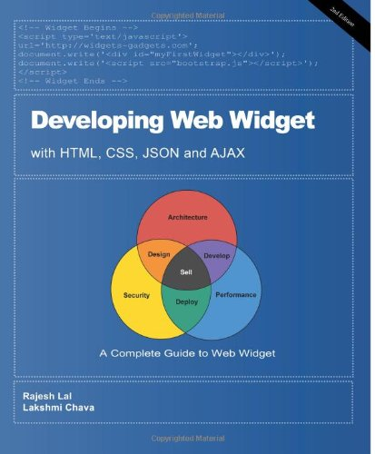
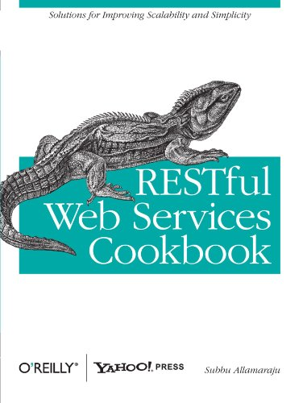
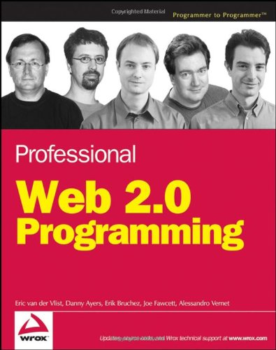
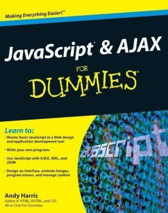
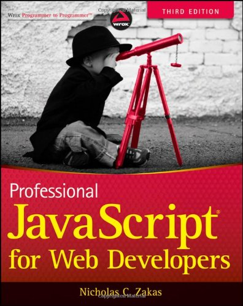
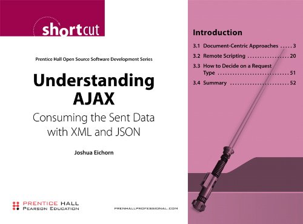

# 有用的 JSON 资源

如果你想在这个页面上列出你的网站，书籍或者其他资源，请联系 webmaster@tutorialspoint.com。

- [JSON 站点](http://www.json.org/) - JSON 官方站点，提供 JSON 规范，新内容和更新内容等等。
- [JavaTM 教程](http://java.sun.com/docs/books/tutorial/index.html) - 这个 Java 教程对于想要使用 Java 编程语言创建应用程序的程序员来说是个实用指南。
- [JSON](http://en.wikipedia.org/wiki/Json) - 免费的百科全书维基百科上的 JSON 参考。
- [免费 Java 下载](http://www.java.com/en/download/index.jsp) - 在这里可以下载你的计算适用的 Java 版本。

## JSON 和 Web 技术方面有用的书籍

