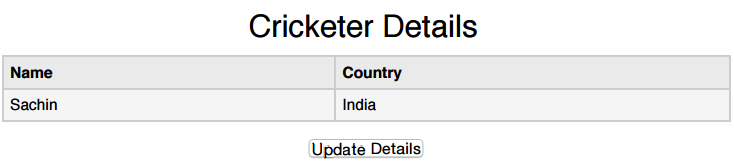

# JSON 与 Ajax

AJAX 就是异步 JavaScript 和 XML，它是一组用于客户端的相互关联的 Web 开发技术，以创建异步 Web 应用程序。遵循 AJAX 模型，Web 应用程序可以以异步的方式发送数据以及从服务器上检索数据，而不影响现有页面的显示行为。

许多开发人员都在客户端和服务器之间使用 JSON 传递 AJAX 更新。实时更新体育成绩的站点就可以视为一个 AJAX 例子。如果这些成绩要更新到站点上，那么必须要把它们存储到服务器上便于需要时网页能取回这些成绩。这里我们可以使用 JSON 格式的数据。

任何使用 AJAX 更新的数据都可以使用 JSON 格式存储在 Web 服务器上。使用 AJAX，那么 JavaScript 就可以在必要时取回这些 JSON 文件，解析它们，然后做以下两件事情：

- 把它们显示到网页上之前将解析的值存储到变量中便于进一步处理。
- 直接分配数据给网页中的 DOM 元素，那么它就会显示在站点上。

## 示例

下面的代码展示了 JSON 和 AJAX，请把它们保存为 __ajax.htm__ 文件。这里的加载函数 loadJSON() 将会使用异步的方式上传 JSON 数据。

```
<head>
<meta content="text/html; charset=ISO-8859-1" http-equiv="content-type">
<script type="application/javascript">
function loadJSON()
{
	var data_file = "http://www.tutorialspoint.com/json/data.json";
	var http_request = new XMLHttpRequest();
	try{
		// Opera 8.0+, Firefox, Chrome, Safari
		http_request = new XMLHttpRequest();
	}catch (e){
		// IE 浏览器处理
		try{
			http_request = new ActiveXObject("Msxml2.XMLHTTP");
		}catch (e) {
			try{
				http_request = new ActiveXObject("Microsoft.XMLHTTP");
			}catch (e){
				// 错误处理
				alert("Your browser broke!");
				return false;
			}
		}
	}
	http_request.onreadystatechange = function(){
		if (http_request.readyState == 4 )
		{
			// 使用 JSON.parse 解析 JSON 数据
			var jsonObj = JSON.parse(http_request.responseText);
			// jsonObj 变量现在包含数组结构，可以通过 jsonObj.name 和 jsonObj.country 的方式访问
			document.getElementById("Name").innerHTML = jsonObj.name;
			document.getElementById("Country").innerHTML = jsonObj.country;
		}
	}
	http_request.open("GET", data_file, true);
	http_request.send();
}
</script>
<title>tutorialspoint.com JSON</title>
</head>
<body>
<h1>Cricketer Details</h1>
<table class="src">
<tr><th>Name</th><th>Country</th></tr>
<tr><td><div id="Name">Sachin</div></td>
<td><div id="Country">India</div></td></tr>
</table>
<div class="central">
<button type="button" onclick="loadJSON()">Update Details </button>
</body>
</html>
```

下面就是包含 JSON 格式数据的输入文件 __data.json__，当我们点击 __Update Detail__ 按钮时会以异步的方式上传它。这个文件已经保存到 [http://www.tutorialspoint.com/json/](http://www.tutorialspoint.com/json/) 上了。

```
{"name": "brett", "country": "Australia"}
```

上面的 HTML 代码会生成如下所示屏幕显示，这里你可以进行 AJAX 实战：



当我们点击 __Update Detail__ 按钮时，应该会得到如下所示的结果，你也可以自己尝试 JSON 和 AJAX，提供你自己的浏览器支持的 JavaScript。

